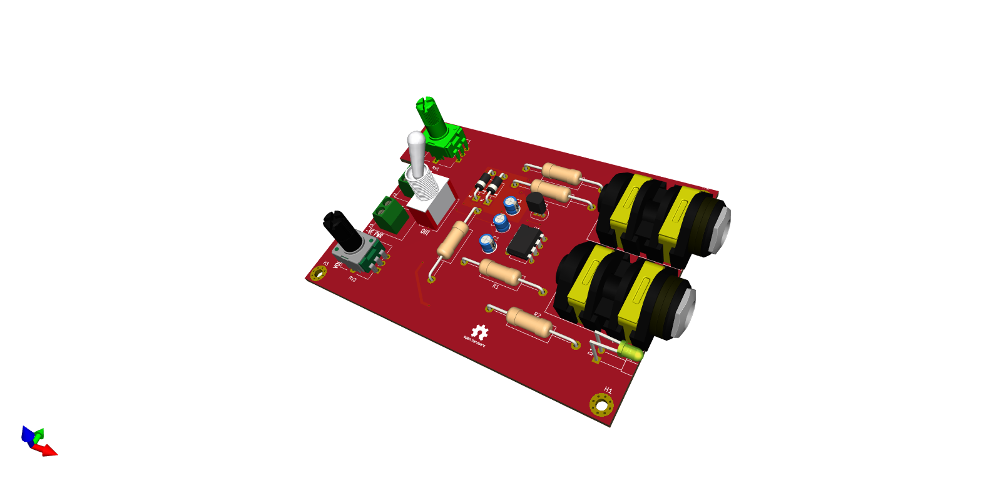
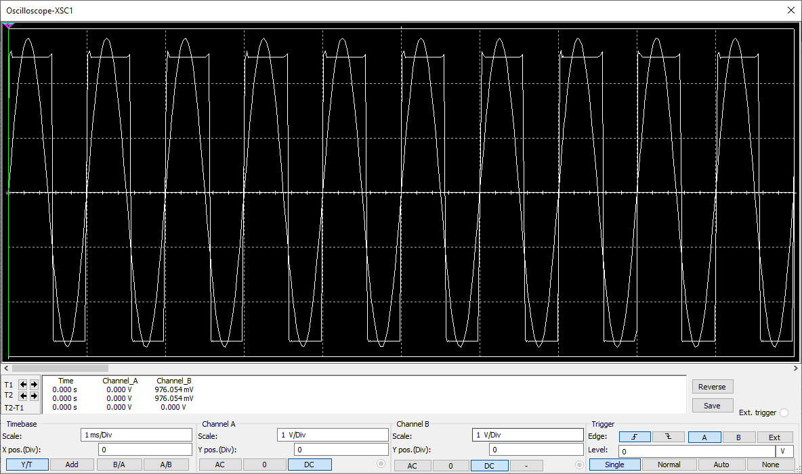
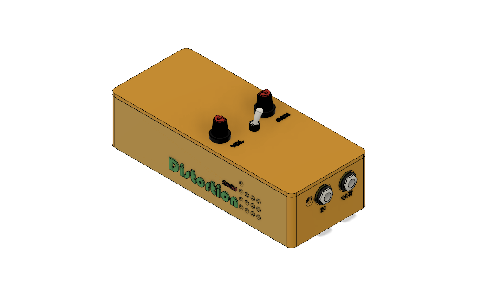

# analog-distortion-guitar-pedal
Analog distortion guitar pedal 

This is a mono analog guitar distortion pedal.

It contains a tunable low pass filter with a BW of 2KHz, gain ranging from 20dB to 40dB, an NPN transistor amplifier stage, an analog clipping circuit for waveform distortion and an output volume control knob.

Input and output is fed by a 6.35mm TRS audio jack.

### Simulations

The waveform above shows how the sinusoidal input wave is clipped into a square wave.

### Power supply

Power supply is a 9V DC split.

### 3D casing view 

